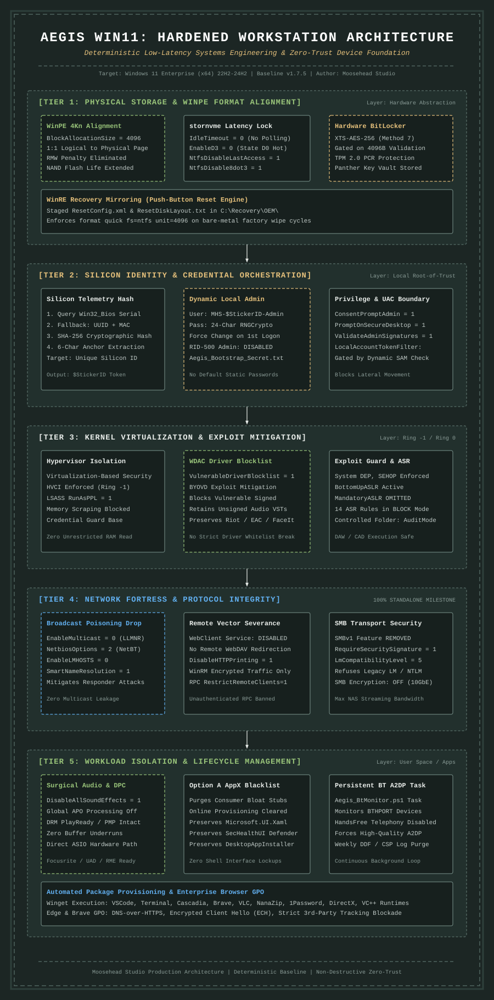

<p align="center">
  
</p>

<h1 align="center">Aegis Win11 Enterprise Deployment Toolkit</h1>

<p align="center"><b>Deterministic Low-Latency Systems Engineering &amp; Zero-Trust Device Foundation</b></p>

<p align="center">
  <a href="https://github.com/narcarsiss/Aegis-Win11/releases/tag/v1.8.0"></a>
  <a href="LICENSE"></a>
  <a href="https://github.com/narcarsiss/Aegis-Win11/wiki"></a>
</p>

---

## 1. Architectural Overview

Aegis Win11 is an automated, unattended provisioning pipeline engineered to replace arbitrary optimization and debloating scripts with verifiable systems engineering. It establishes a defense-in-depth posture while preventing runtime conflicts within high-performance workstations.

Standard OS stripping scripts regularly induce system failures by severing mandatory networking components (such as unbinding IPv6), degrading process boundaries (grouping svchost.exe instances to claim trivial memory reductions), disabling system memory paging mechanisms, or injecting unvalidated storage driver overrides. Aegis Win11 isolates telemetry, minimizes persistence vectors, and enforces Microsoft Defender Application Control (WDAC) driver blocklists while explicitly maintaining hardware abstraction layers, low-latency audio pipelines, and enterprise identity integration.

---

## 2. Systems Architecture Blueprint

<p align="center">
  
</p>

---

## 3. Workload Compatibility & Boundary Matrix

Every policy within Aegis Win11 is evaluated against four non-negotiable operational workstation targets:

*   **Digital Audio Workstations (DAWs):** Preserves native ASIO hardware driver abstraction layers (Focusrite, Universal Audio, RME, Behringer, MOTU). Disables Audio Processing Objects (APOs) via `DisableAllSoundEffects` to eliminate DPC latency spikes while keeping DRM protected media pipelines (Widevine, PlayReady) operational. MMCSS Audio task thread priorities are locked to real-time (`Priority = 8`).
*   **Computer-Aided Design (CAD) & Rendering Suites:** Maintains nested directory depths via NTFS Long Paths (`LongPathsEnabled = 1`), disables NTFS timestamp write operations (`NtfsDisableLastAccessUpdate = 1`), disables 8.3 short filename generation (`NtfsDisable8dot3NameCreation = 1`), and enforces Hardware-Accelerated GPU Scheduling (HAGS) for applications including Autodesk Revit, AutoCAD, Blender, and Adobe Creative Cloud.
*   **Competitive Gaming & Anti-Cheat Runtimes:** Omits strict kernel-mode code integrity policies (`CodeIntegrityPolicy = 1`) and system-wide Mandatory ASLR, ensuring compatibility with kernel-level anti-cheat platforms (Riot Vanguard, Easy Anti-Cheat, BattlEye) and local gaming clients (Steam, Epic Games).
*   **Enterprise Suites & Identity Management:** Supports both standalone workstation topologies and enterprise domains via Microsoft Entra ID / Local Administrator Password Solution (LAPS) integration toggles, preserving Windows Remote Management (WinRM) and modern Kerberos/NTLMv2 authentication pathways.

---

## 4. CIS Benchmark & NIST Compliance Posture

Aegis Win11 aligns with technical controls from the Center for Internet Security (CIS) Microsoft Windows 11 Enterprise Benchmark (v3.0.0) and NIST SP 800-53 Rev 5 / NIST SP 800-171 Rev 2.

### Compliance Coverage Breakdown

*   **CIS Level 1 Profile (Enterprise Baseline):** ~24% direct implementation (~60 active configuration directives).
*   **CIS Level 2 Profile (High Security / Defense-in-Depth):** ~11% selective implementation.
*   **Standalone Implementation (Non-Domain Applicable):** 63.0% of CIS Level 1 and 75.9% of NIST SP 800-53 workstation controls.
*   **Network & Protocol Fortress:** 100% compliance across all applicable standalone network boundaries.

### Documented Technical Deviations

To maintain credibility during external audits and peer review, the framework documents intentional deviations from the CIS Level 2 benchmark:

1.  **Process Mitigation (CIS 18.10.14.2.1):** Bottom-Up ASLR, DEP, and SEHOP are enforced system-wide. Mandatory ASLR (`MandatoryASLR`) is intentionally omitted; enforcing Mandatory ASLR globally causes immediate load termination for binaries and third-party audio/graphics DLLs not compiled with `/DYNAMICBASE`.
2.  **PowerShell Constrained Language Mode (CIS 18.10.43.1):** Not enforced globally via system policies. Constrained Language Mode completely halts automation scripts, CI/CD runners, and un-cataloged DAW package installation logic.
3.  **Controlled Folder Access (CIS 18.10.43.4.2):** Defaulted to `AuditMode`. Enforcing CFA in `Block` mode stops creative software (FL Studio, Ableton, Autodesk) and game runtimes from writing legitimate save states, scratch files, and presets to `%USERPROFILE%\Documents`.
4.  **Network Protocol Binding (IPv6):** IPv6 adapter bindings remain active. Microsoft core networking identifies IPv6 as a mandatory OS component; disabling IPv6 breaks Teredo gaming discovery, Entra ID hybrid join state sync, and WinRM listeners.
5.  **SMB3 Payload Encryption (CIS 2.3.8.3):** Mandatory SMB payload encryption (`EncryptData = 1`) is omitted. Packet signing (`RequireSecuritySignature = 1`) is enforced to stop NTLM relay attacks, but payload encryption is withheld to avoid saturating workstation CPU cores during multi-gigabit media transfers across local NAS devices.

---

## 5. Staging & Unattended Deployment Topology

Deployment occurs across three discrete execution boundaries coordinated through `autounattend.xml` and staged PowerShell logic.

```
INSTALLER_USB:
└───autounattend.xml
└───sources
    └───OEMOEM
        └───$1
            └───Aegis
                └───AegisWin11_Deploy.ps1
```

> [!WARNING]
> ### Clean Disk 0 Partitioning Notice
> The baseline `autounattend.xml` includes automated disk partitioning with `<WillWipeDisk>` set to `$true` on `<DiskID>` set as `0`. On systems with multiple storage drives, ensure the target installation drive enumerates as Disk 0 in the UEFI BIOS prior to boot, or disconnect/disable secondary SATA/AHCI drives upon initial staging.

---

## 6. Parameter Reference (`AegisWin11_Deploy.ps1`)

| Parameter | Type | Default | Operational Impact |
| :--- | :--- | :--- | :--- |
| `-EnableAntiForensicMode` | Switch / Boolean | `$false` | When `$false`, configures 64MB event logs and enables Event ID 4688 command-line process auditing. When `$true`, caps logs at 1024KB, disables process auditing, purges Prefetch, and clears the USN journal. |
| `-EnforceDeviceEncryption` | Switch / Boolean | `$true` | When `$true`, verifies 4KB allocation unit size and provisions BitLocker XTS-AES-256 with TPM protection. |
| `-EnableLAPS_EntraIDSupport` | Switch / Boolean | `$false` | When `$true`, enables `LocalAccountTokenFilterPolicy` and drops `RestrictAnonymousSAM` once the dynamic anchor user is verified. Bypasses local plaintext key export in favor of cloud escrow. |
| `-ServiceTagIDEnableHardware` | Switch / Boolean | `$true` | Generates the administrative identity anchor from the BIOS serial number. Falls back to UUID/MAC SHA-256 hash if unavailable. |
| `-EnableEdgeTweaks` | Switch / Boolean | `$true` | Applies 33 enterprise security GPOs to Edge and Brave, including DNS-over-HTTPS, ECH, and tracking blocks. |
| `-EnableTelemetryPurge` | Switch / Boolean | `$true` | Strips consumer diagnostic tracking, Cortana, Windows Feeds, and advertising identifiers. |
| `-DeployWingetPackages` | Switch / Boolean | `$true` | Executes automated, unattended Winget package installations for baseline development and runtime tools. |
| `-EvacuateLegacyCapabilities` | Switch / Boolean | `$true` | Removes deprecated attack surfaces: WordPad, VBScript, WMIC, and PowerShell v2. |
| `-PurgeShellUI` | Switch / Boolean | `$true` | Executes Option A targeted bloatware removal and wipes pinned items via Policy Manager. |
| `-PurgeOneDrive` | Switch / Boolean | `$false` | When `$true`, uninstalls consumer OneDrive and removes explorer sidebar namespace CLSIDs. |
| `-AICreativeKernelTuning` | Switch / Boolean | `$false` | When `$true`, extends GPU Timeout Detection and Recovery (TDR) limits to 60 seconds. |
| `-ChangeDefaultWin11Name` | Switch / Boolean | `$true` | Updates the BCD bootloader description to `Win11_Aegis_OS-$StickerID`. |
| `-EnableVBS` | Switch / Boolean | `$true` | Enforces Virtualization-Based Security via group policy. |
| `-EnableHVCI` | Switch / Boolean | `$true` | Enforces Hypervisor-Enforced Code Integrity for kernel execution. |
| `-Unattended` | Switch / Boolean | `$true` | Suppresses interactive GUI modal dialogues, routing credentials to the transcript file. |
| `-AutoReboot` | Switch / Boolean | `$true` | Executes an automated reboot upon pipeline completion. If `$false`, pauses for operator interaction. |
| `-ControlledFolderAccessMode` | String (`Disabled`, `Enabled`, `AuditMode`) | `"AuditMode"` | Configures Microsoft Defender Controlled Folder Access. Defaulted to `AuditMode` to prevent DAW/CAD save failures. |
| `-DefaultSearchProvider` | String | `"duckduckgo"` | Sets the default search engine configuration across enterprise browsers. |

---

## 7. Subsystem Implementations

### Hardware Identity Engine
The framework dynamically provisions a unique, hardware-bound administrative anchor during installation:
1.  Queries `Win32_Bios.SerialNumber`. If non-standard, queries `Win32_ComputerSystemProduct.UUID` and hashes the output via SHA-256 to create a 6-character identifier (`$StickerID`).
2.  Provisions `MHS-$StickerID-Admin` with a 24-character cryptographic password generated at runtime via `System.Security.Cryptography.RandomNumberGenerator`.
3.  Enforces an immediate credential reset upon first interactive console login (`net user ... /logonpasswordchg:yes`).
4.  Exports the secret to `C:\Windows\Panther\Aegis_Bootstrap_Secret.txt` under strict ACL permissions restricted to `SYSTEM` and `Administrators`, then disables the built-in `Administrator` account (`SID S-1-5-500`).

### Storage Subsystem & Recovery Engine Architecture
1.  **Unified 4096-Byte File Allocation:** The `autounattend.xml` schema forces `BlockAllocationSize = 4096` on volume `C:` during the clean WinPE format pass. Matching NTFS cluster sizes to physical 4KB NAND pages eliminates Read-Modify-Write (RMW) amplification loops, extending flash endurance and reducing I/O write latency.
2.  **Metadata & Index Suppression:** Sets `NtfsDisableLastAccessUpdate = 1` and `NtfsDisable8dot3NameCreation = 1` during OOBE setup. This stops Master File Table (MFT) write thrashing and eliminates 8.3 short filename generation overhead across directories containing massive file counts.
3.  **Continuous Controller Readiness:** Configures `IdleTimeout = 0` and `EnableD3 = 0` under `stornvme\Parameters\Device`, keeping NVMe links in active power state D0 and eliminating controller wake-up latency during real-time I/O processing.
4.  **Storage Sense Automation:** Injects native policies (`AllowStorageSenseGlobal = 1`, `ConfigStorageSenseCloudContentCleanThreshold = 30`) to purge unreferenced temporary files automatically.
5.  **Push-Button Reset (PBR) 4KB Mirroring:** Stages a bare-metal recovery engine via `C:\Recovery\OEM\ResetConfig.xml`. If a full wipe reset is executed, WinRE formats the system partition using an exact 4096-byte quick format (`format quick fs=ntfs unit=4096`), guaranteeing that factory recovery operations maintain physical NAND page alignment.
6.  **Silent Hardware BitLocker Pipeline:** Validates that TPM 2.0 is ready and that volume `C:` possesses an allocation unit size of exactly 4096 bytes before silently enabling XTS-AES-256 BitLocker encryption with a TPM protector. If `-EnableLAPS_EntraIDSupport` is false, it archives the recovery password to `C:\Aegis_BitLocker_Recovery.txt`; otherwise, local export is bypassed in favor of cloud escrow.

### Consumer Bloatware Sanitization
Aegis Win11 rejects blanket wildcard AppX removal scripts (`Get-AppxPackage | Remove-AppxPackage`). Indiscriminate package uninstallation destroys versioned Windows 11 system runtimes (`Microsoft.UI.Xaml.2.8`), the Windows Security Center interface (`Microsoft.SecHealthUI`), and Microsoft Store infrastructure required for Winget package management.

The framework enforces an explicit, non-destructive consumer blacklist targeting third-party and non-essential consumer stubs (BingNews, BingWeather, Clipchamp, Solitaire, Zune Video, Todos). Both installed instances and online provisioned stubs (`Get-AppxProvisionedPackage`) are uninstalled, preventing re-provisioning on secondary local user profiles while keeping system dependencies intact.

### Targeted Desktop Audit & Logs Delivery
The deployment report (`Aegis_Deployment_Report.txt`) and a direct shortcut to `C:\Windows\Panther` (`Deployment_Logs.lnk`) are generated during finalization and staged in the Panther vault. A post-install first-logon dispatcher (`Aegis_PostLogon_Cleanup.ps1`) transfers these files directly onto the created administrator's desktop (`MHS-$StickerID-Admin`), ensuring full visibility while keeping public and unprivileged desktops clean.

---

## 8. Verification & Diagnostic Auditing

Post-installation validation can be executed using elevated PowerShell diagnostic commands:

```powershell
# 1. Verify 4KB Allocation Unit Size
Get-Volume -DriveLetter C | Select-Object DriveLetter, AllocationUnitSize, FileSystemLabel

# 2. Verify BitLocker Encryption Status and Algorithm (XtsAes256)
Get-BitLockerVolume -MountPoint "C:" | Select-Object MountPoint, ProtectionStatus, EncryptionMethod, VolumeType

# 3. Verify Attack Surface Reduction Rules (14 Rules in Block Mode)
Get-MpPreference | Select-Object -ExpandProperty AttackSurfaceReductionRules_Ids
Get-MpPreference | Select-Object -ExpandProperty AttackSurfaceReductionRules_Actions

# 4. Verify Exploit Guard System Mitigations
Get-ProcessMitigation -System

# 5. Verify User Rights Assignment for Network Logons
secedit.exe /export /cfg "$env:TEMP\secpol_verify.inf" /areas USER_RIGHTS /quiet
Select-String -Path "$env:TEMP\secpol_verify.inf" -Pattern "SeNetworkLogonRight"
Remove-Item -Path "$env:TEMP\secpol_verify.inf" -Force
```

---

## 9. Community & Technical Support

*   **Wiki Documentation:** [Aegis-Win11 Wiki](https://github.com/narcarsiss/Aegis-Win11/wiki)
*   **Technical Reference Manual:** [44-Item Policy Matrix](https://github.com/narcarsiss/Aegis-Win11/wiki/Technical-Reference-Manual)
*   **Security Architecture Report:** [Formal Compliance Audit](https://github.com/narcarsiss/Aegis-Win11/wiki/Security-Architecture-&-Compliance-Report)
*   **Community Discussions:** [GitHub Discussions](https://github.com/narcarsiss/Aegis-Win11/discussions)

---

## 10. License

Released by Moosehead Studio under the MIT License. See `LICENSE` for details.
```
